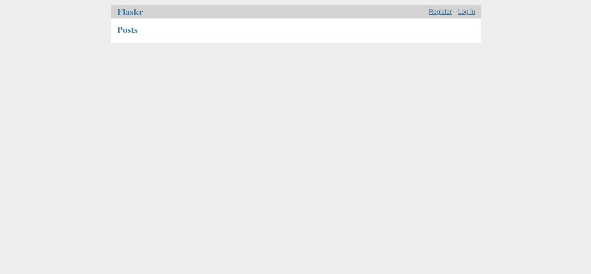

# MINGGU 11 - PEMROGRAMAN WEB

## FLASKR TUTORIAL

> Flask adalah kerangka kerja aplikasi web bersifat kerangka kerja mikro yang ditulis dalam bahasa pemrograman Python dan menggunakan dependensi Werkzeug dan Jinja2. Aplikasi yang menggunakan Flask antara lain adalah Pinterest, LinkedIn, dan halaman web komunitas situs Flask itu sendiri.

> Flask itu fleksibel. Anda tidak perlu menggunakan proyek atau tata letak kode tertentu. Namun, saat pertama kali memulai, sebaiknya gunakan pendekatan yang lebih terstruktur. Ini berarti bahwa tutorial akan memerlukan sedikit boilerplate di awal, tetapi hal itu dilakukan untuk menghindari banyak jebakan umum yang dihadapi pengembang baru, dan ini menciptakan proyek yang mudah untuk dikembangkan. Setelah Anda merasa lebih nyaman dengan Flask, Anda dapat keluar dari struktur ini dan memanfaatkan sepenuhnya fleksibilitas Flask.

### INSTALL

> Clone repository flask

```
# clone the repository
$ git clone https://github.com/pallets/flask
$ cd flask
# checkout the correct version
$ git tag  # shows the tagged versions
$ git checkout latest-tag-found-above
$ cd examples/tutorial
```

> Buat virtualenv dan aktifkan :

```python
$ python3 -m venv venv
$ . venv/bin/activate
```

> Atau di Windows cmd:

```python
$ py -3 -m venv venv
$ venv\Scripts\activate.bat
```

> Instal Flaskr:

```python
$ pip install -e .
```

> Atau jika Anda menggunakan cabang utama, instal Flask dari sumber sebelum menginstal Flaskr:

```python
$ pip install -e ../..
$ pip install -e .
```

### RUN

```python
$ export FLASK_APP=flaskr
$ export FLASK_ENV=development
$ flask init-db
$ flask run
```

> Atau di Windows cmd:

```python
> set FLASK_APP=flaskr
> set FLASK_ENV=development
> flask init-db
> flask run
```

> Open http://127.0.0.1:5000 in a browser.

### TEST

```python
$ pip install '.[test]'
$ pytest
```

> Jalankan dengan laporan cakupan:

```python
$ coverage run -m pytest
$ coverage report
$ coverage html  # open htmlcov/index.html in a browser
```

> hasil tampilan
> 

